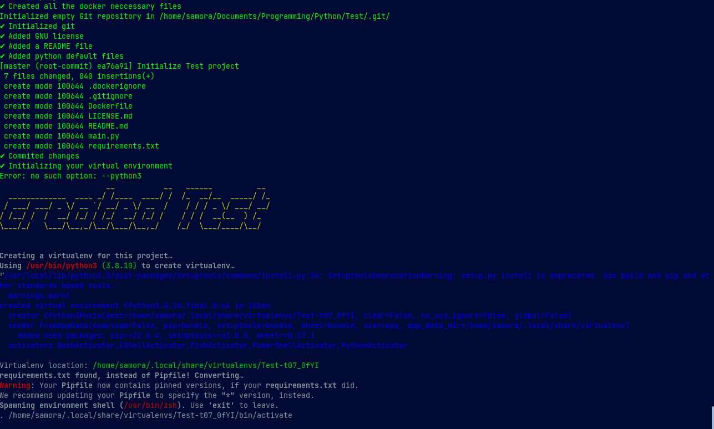

# Python Project Starter Script 

This is a simple project that reduces redundacy while creating a new python project. 
The project taloir made based on my preferences when I start a new project.

The script does the following :

    - project folder creation
    - dockerization
    - creations of related git files and populates the gitignore with a generic template
    - creation of README file
    - creation of GNU license file
    - virtual environment creation
    - creation of test 


## Requirement
The project currently support `python 3` only. The project is also only supported on linux based system. Support for other operating system will be added later. </br>

The user is also requrired to have `pipenv` installed within the system. 
For pip installation procedure use the link below: 

- [pipenv](https://pypi.org/project/pipenv/)
    > Installed using
    ```bash
    pip install --user pipenv
    ```
- [pytest]()
    > Installed using 
    ```bash
    pip install -U pytest
    ```
- [pytest-cov]()
    > Installed using 
    ```bash
    pip install pytest-cov
    ```
- [docker](https://docs.docker.com/get-docker/)
- [git](https://git-scm.com/downloads)
## Installation
First install the requirements using
```bash
pip install -r requirements.txt 
```

get the relative path of the `main.py` file by using the following command in the terminal

```bash
pwd
```

a sample output will be displayed
 > /home/\<username>/Documents/scripts/create-project-script/

copy the ouptut and move to root using

```bash
cd ~
```

Now, we are going to modify the shell file so that our terminal may recognize and call our script file like a normal command.
Depending on the type of shell your using there is a file containing the codes for the shell your using, for example if your using `bash` then the file will be `.bashrc` or if your using `zsh` then the file will be `.zshrc`.<br/>
Open the relevant file like so:

```bash
nano .bashrc 
```

this will open a terminal based text editor, you will then navigate to the end of the file and add the following

```bash
alias project="python3 <path you had copied>/main.py"
```

therefore your added line will look something of sort

```bash
alias project="python3 /home/user/Document/create-script/main.py"
```
Save the edits in the file using `Ctrl + o` then press `Enter` and exit the text editor using `Ctrl + x` </br>
now you can close your terminal and then open it again so that the changes are effective.


## Usage
Once everything is complete, you can now create you project using the following syntax

`project <project-name> -d <project-description>`

therefore is will look something of sort

```bash
project Test -d "Sample project"
```

the execution of the program should produce a similar output as below





